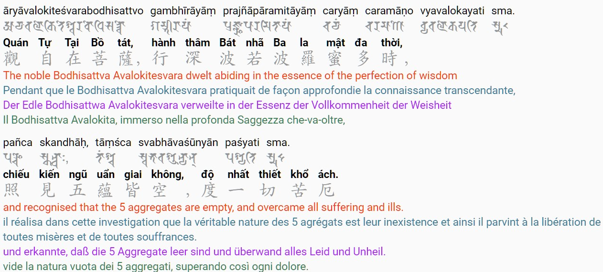

# Vietnamese Mahayana Buddhist liturgy in multiple languages

thiền môn nhật tụng Việt bằng nhiều thứ tiếng

to be used in liturgy, please ask for a Vietnamese to guide you

**DISCLAIMER: this is a work of compilation, not garanted for authenticity**

feel free to contact me if you need more detailed references

the site is online here: https://phineas-pta.github.io/kinh_nhat_tung/

many thanks to @buddhist-uni for sharing my work on [their site](https://buddhistuniversity.net/content/reference/kinh-nhat-tung_phineas-pta)

# web page formatting

|  |
|:--:|
| *Screenshot showing Heart Sutra example* |

some selected sutras include Sanskrit version in Siddham script

option to show/hide languages

option to toggle dark mode

additional setup:

 - Favicon: SuttaCentral: https://raw.githubusercontent.com/suttacentral/suttacentral/master/client/img/favicon.ico
 - Google Noto Sans Siddham font: https://github.com/googlefonts/noto-fonts/blob/master/hinted/ttf/NotoSansSiddham/NotoSansSiddham-Regular.ttf, under the [SIL OFL v1.1](assets/fonts/OFL.txt)
 - AR PL (Arphic Public Licensed) UKaiHK font: https://github.com/SilentByte/fonts-arphic-ukai/blob/master/fonts-arphic-ukai/ukai.ttc, under the [Arphic public license](assets/fonts/ARPHICPL.txt)
 - Charmonman font: https://github.com/cadsondemak/Charmonman/blob/master/fonts/Charmonman-Regular.ttf, under the [SIL OFL v1.1](assets/fonts/OFL.txt)
 - Grenze Gotisch font: https://github.com/Omnibus-Type/Grenze-Gotisch/blob/master/fonts/ttf/GrenzeGotisch-ExtraBold.ttf, under the [SIL OFL v1.1](assets/fonts/OFL.txt)
 - MuseoModerno font: https://github.com/Omnibus-Type/MuseoModerno/blob/master/fonts/ttf/MuseoModerno-Regular.ttf, under the [SIL OFL v1.1](assets/fonts/OFL.txt)

*additional file*: `quotations.html`: predecessor of the site

# use locally

with Jekyll: `bundle install` to install all dependencies then `bundle exec jekyll serve --no-watch`

with Docker: `docker run -p 4000:4000 horimiyasanxmiyamurakun/dr.doofenshmirtz`
