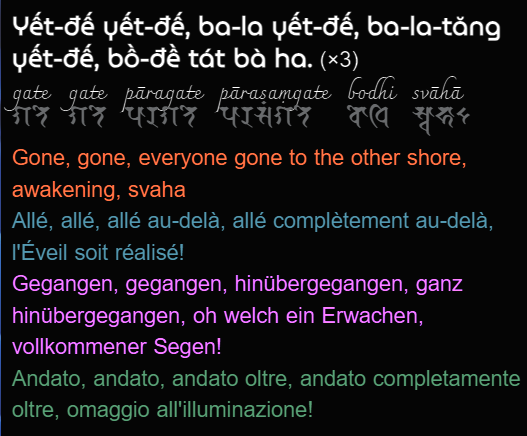

# Vietnamese Mahayana Buddhist liturgy in multiple languages

thiền môn nhật tụng Việt bằng nhiều thứ tiếng

to be used in liturgy, please ask a Vietnamese for help when using this site, i'll make a proper language switcher when i have time

**DISCLAIMER: this is a hobby project, academic accuracy not guaranteed**

feel free to contact me if you need more detailed references

many thanks to The Open Buddhist University for sharing my project on [their site](https://buddhistuniversity.net/content/reference/kinh-nhat-tung_phineas-pta)

the site is online here: https://phineas-pta.github.io/kinh_nhat_tung/ — backup: https://phineas-pta.gitlab.io/kinh_nhat_tung/

main source code: https://github.com/phineas-pta/kinh_nhat_tung — backup: https://gitlab.com/phineas-pta/kinh_nhat_tung

## web page formatting

|  |
|:--:|
| *Screenshot showing Heart Sutra example* |

no cookies nor external JavaScript libraries

some selected sutras include Sanskrit text in Siddham script & romanized (IAST)

option to show/hide languages

option to toggle dark mode

additional setup:

 - Favicon: SuttaCentral: https://raw.githubusercontent.com/suttacentral/suttacentral/master/client/img/favicon.ico
 - Google Noto Sans Siddham font: https://github.com/googlefonts/noto-fonts/blob/master/hinted/ttf/NotoSansSiddham/NotoSansSiddham-Regular.ttf, under the [SIL OFL v1.1](assets/fonts/OFL.txt)
 - AR PL (Arphic Public Licensed) UKaiHK font: https://github.com/SilentByte/fonts-arphic-ukai/blob/master/fonts-arphic-ukai/ukai.ttc, under the [Arphic public license](assets/fonts/ARPHICPL.txt)
 - Charmonman font: https://github.com/cadsondemak/Charmonman/blob/master/fonts/Charmonman-Regular.ttf, under the [SIL OFL v1.1](assets/fonts/OFL.txt)
 - Grenze Gotisch font: https://github.com/Omnibus-Type/Grenze-Gotisch/blob/master/fonts/ttf/GrenzeGotisch-ExtraBold.ttf, under the [SIL OFL v1.1](assets/fonts/OFL.txt)
 - MuseoModerno font: https://github.com/Omnibus-Type/MuseoModerno/blob/master/fonts/ttf/MuseoModerno-Regular.ttf, under the [SIL OFL v1.1](assets/fonts/OFL.txt)

convert `.ttf` → `.woff2` using https://github.com/google/woff2

UKai font: originally `.ttc` → use FontForge to extract HK `.ttf` (№ 2)

*additional file*: `quotations.html`: predecessor of the site

## use locally

with Jekyll: `bundle install` to install all dependencies then `bundle exec jekyll serve --no-watch`

the site is served at `localhost:4000/kinh_nhat_tung/`

with Docker: `docker run -p 8000:8000 horimiyasanxmiyamurakun/dr.doofenshmirtz:kinh_phat`

the site is served at `localhost:8000`

## misc

